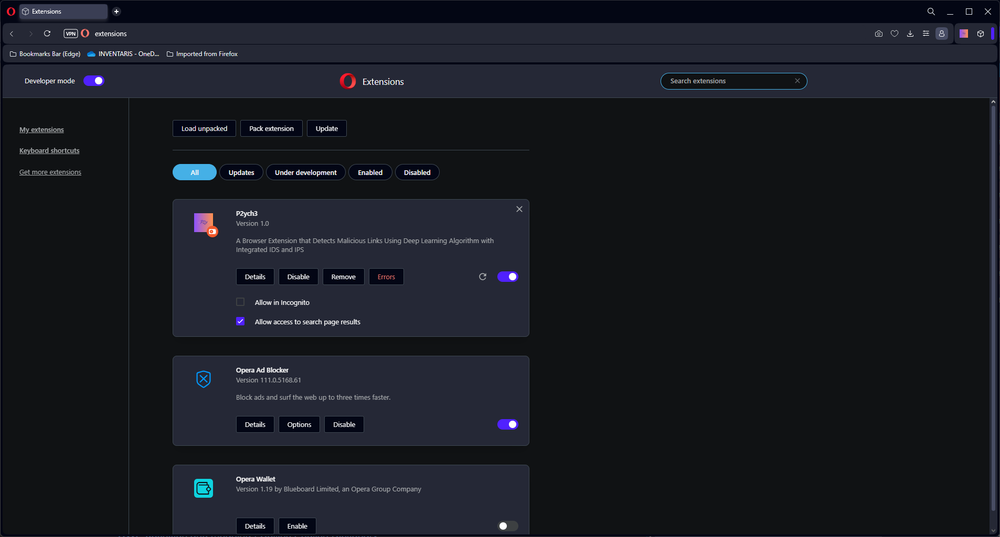
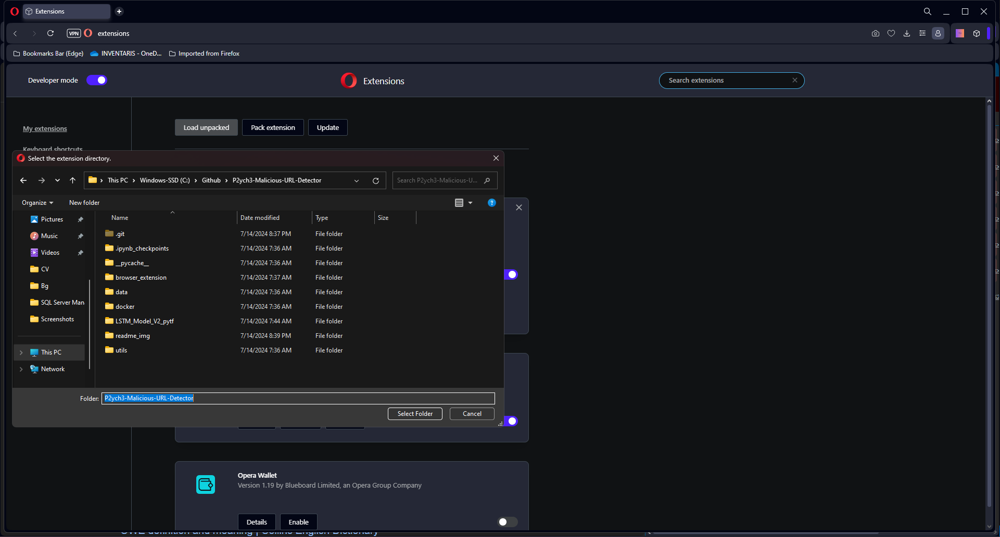
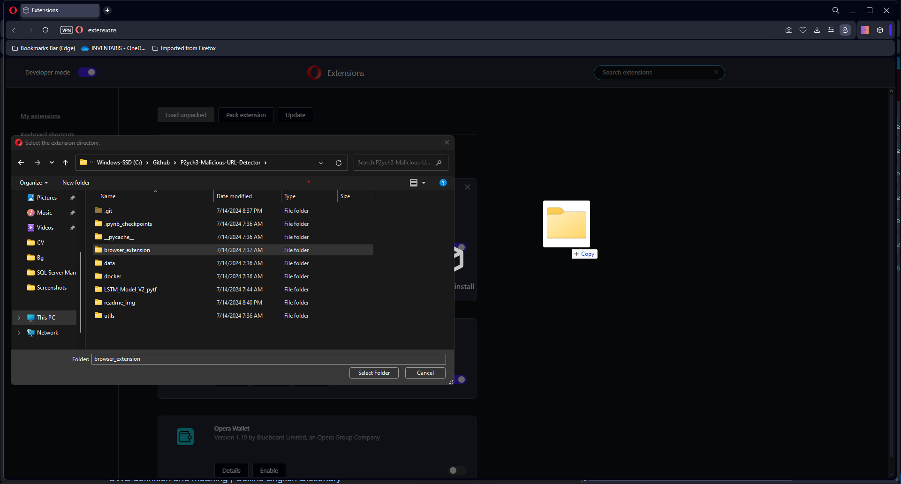
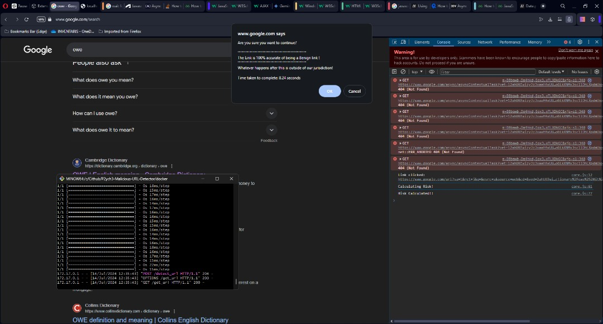

# P2ych3:Malicious URL Detector with IDS and IPS

## Prerequisites
- docker-desktop
- every code below was ran on git bash with Windows OS
- python

## Folder Architecture
    .
    ├─── LSTM_Model_V2_pytf                 # A '.h5' saved model
    ├─── browser_extension                  # browser extension utilities
    │    ├───extension_icon
    │    └───pop_up
    ├─── data                               # dataset utilized
    ├─── docker                             # docker image configuration
    │    ├───data
    │    ├───dock_utils
    │    └───LSTM_Model_V2_pytf
    ├─── readme_img                         # images linked in readme.md
    ├─── utils                              # Necessary functions/modules
    ├─── .gitattributes
    ├─── LICENSE
    ├─── README.md
    └─── Training.ipynb

## How-to

### Initializing the extension
Clone this Github Repository to your local machine
```bash
git clone https://github.com/OMCSB/Malicious-URL-Detector.git
```

> [!IMPORTANT]
> Run the training.ipynb once

Open `chrome://extensions`


Select `Load Unpacked`


Select Folder that holds your `manifest.json`


### Running the Extension

> [!IMPORTANT]
> Make sure that Docker-Desktop is opened

Traverse to the `docker` folder within the Local Github Repository
```bash
cd path/to/docker/folder
```

Build the Docker Iamge if not available
```bash
docker build --tag image_name
```

Run the Docker Image
```bash
docker run -p 5000:5000 image_name
```
The code above ^ will create a docker container that is assigned to port `5000`. To see the raw JSON format of the data, go to `localhost:5000/get_url`

When everything is done, to delete all container that is NOT RUNNING.
```bash
docker container prune
```

### Expected Output
Output #1 - Detecting Malicious/Benign URL


### Limitations and Future Work
